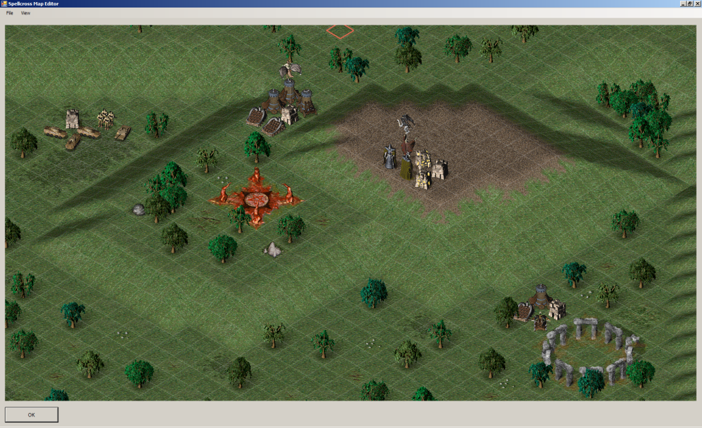
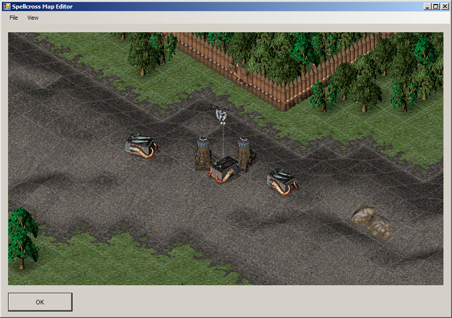
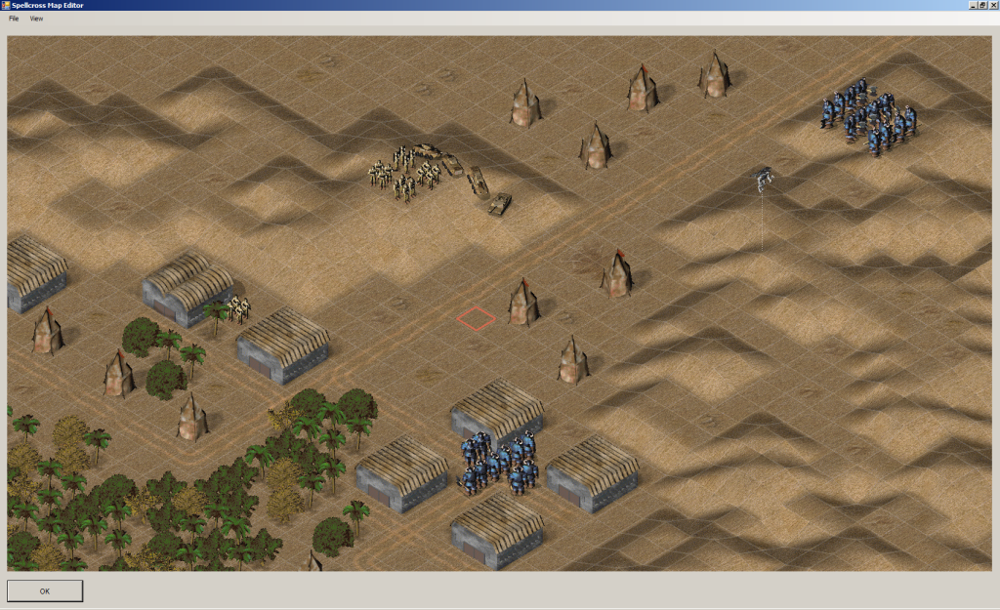

# Spellcross Map Editor

This project is (will be) highly experimental tool for editing game map files of my favourite turn based strategy game [Spellcross](https://wikipedia.org/wiki/Spellcross).
The project is basically collection of my reverse engineering experimental [tools](http://spellcross.kvalitne.cz) made around 2007 - 2013.
The tools were made in Borland Developer Studio BDS2006 Turbo C++ with VCL graphics interface and the code was very nasty mix of ANSI C and C++. 
Lately I decided to try to learn C++ a bit so I decided to scoop the bits of code, the loaders, the decoders and renderers of the Spellcross data files, convert them to C++ classes using standard libraries and eventually merge them into one application. The resulting application should be map editor. I already had one simplistic prototype in past in the BDS2006, but the whole application was very messy, mixed GUI and code, so I rather started again. Note the code is still quite messy, because I had no time to refactor it yet, but already does something.

I decide to use MSVC environment as I already had it on my desktop and I used deprecated Windows Forms GUI for now, but I will be replace it by some other multiplatform GUI later because the mix of C++ and .NET interface in the Windows Forms application is just awful.  

So far the tool can do just few things:
- Load terrain sprites (tiles, objects, tile animations, sprite animations).
- Load unit graphics (20000+ compressed sprites) and units definition file JEDNOTKY.DEF.
- Load map DTA file and partially decode map script files DEF with unit positions.
- Runtime render the map section.

    

                                 
## License
The tool is distributed under [MIT license](./LICENSE.txt). 
  
  
