# Spellcross Map Editor

This project is highly experimental tool for editing game map files of my favourite turn based strategy game [Spellcross](https://wikipedia.org/wiki/Spellcross). Apart from editor function it also allows to view, export but also encode various game resources.
The project is basically a collection of my reverse engineering experimental [tools](https://spellcross.kvalitne.cz) made around 2007 - 2013.

## History

Those old tools were made in Borland Developer Studio BDS2006 Turbo C++ with VCL graphics interface and the code was very nasty mix of C and C++. 
Around 2021 I decided to try to learn C++ a bit more so I decided to scoop the bits of my old code, the loaders, the decoders and renderers of the Spellcross data files, convert them to C++ classes using only standard C++ and multiplatform libraries and eventually merge them into one application. The result is this map editor project. The code is still quite messy, because I had no time to refactor it yet, but definitely better than before.
Borland C++ with its VCL GUI (later RAD studio) is dead end and VCL implementation was always quite a mess anyway, so I decided to use MSVC 2019 environment as I'm a bit familiar with it. But I'm not a masochist to use its Windows Forms GUI because it's using really awful C++ to .NET interface which seems to me quite unneccessary. Instead I decided to use multiplatform GUI [wxWidgets](https://wxwidgets.org) which seems reasonably simple to use and still maintained.

## What can it do

It is far from being done but it's getting more and more capable. Here are basic features:

- Load all terrain sprites (tiles, objects, tile animations, sprite animations).
- Load all unit graphics (20000+ compressed sprites) and units definition file JEDNOTKY.DEF. 
- Load and play sound resources.
- Load and play MIDI music resources. 
- Load and play video resources (DPK, DP2 fully implemented, CAN only audio because it is [Cauldron](https://sk.wikipedia.org/wiki/Cauldron) proprietary codec).
- Load and save map DTA files and DEF map script files.
- Runtime render the map with all its layers.
- Very crude map terrain editing (mostly only copy/paste). Autotile mapping not done yet.
- Creating and using object templates to make editing more practical. 
- Edit/add/remove units in the map.
- Edit/add/remove mission events and objectives.
- Save map DTA files and map script DEF files.
- Export graphical and text resources.
- Encode graphics and text resource to Spellcross formats.

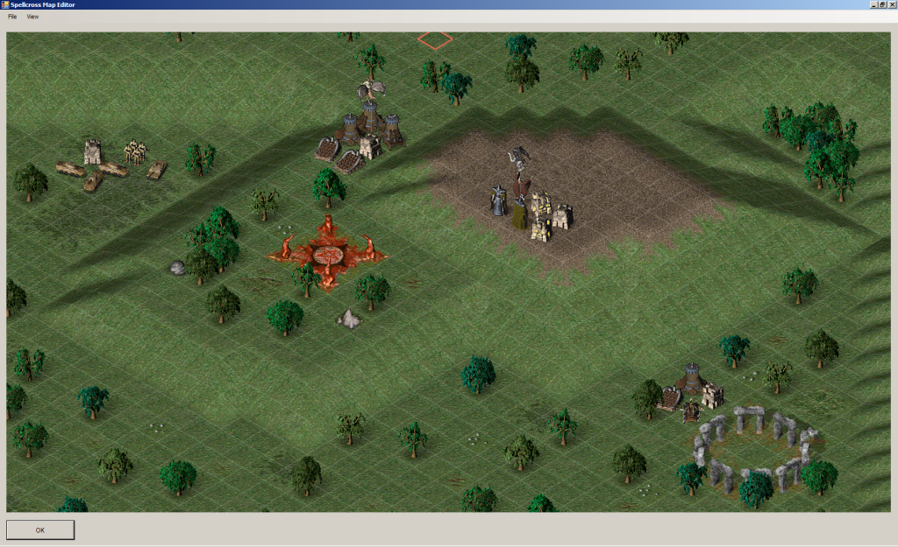    
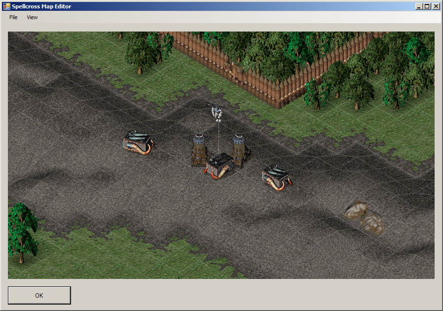
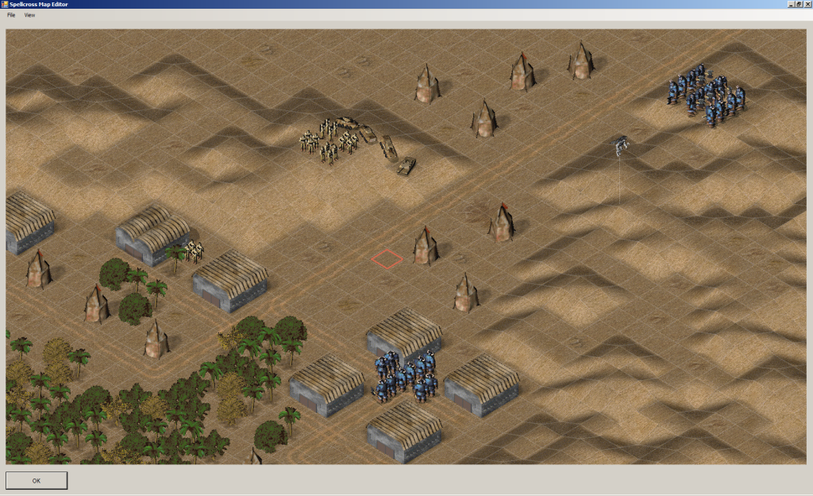

## Usage

There is no detailed help yet so the usage will be more or less trial and error for the user. The only thing that needs to be setup are paths to Spellcross data files. You need installed Spellcross game with the `*.FS` and `*.FSU` files in the game `DATA` sub-folder. If your version of the game includes CD, you'll also need it (its copy) because part of the data files are located in CD `DATA` folder (`MOVIE.FS`, `INFO.FS`, `SPEAKER.FS`). When you run the Editor for a first time, it should show dialog with paths setup:

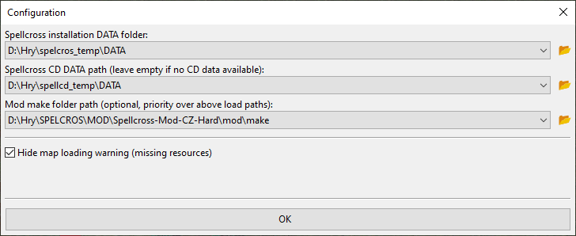

There are three paths to be defined. First is `Spellcross installation DATA folder` which should point to `DATA` folder of your installed game, so e.g. `C:\GAMES\SPELCROS\DATA`. If your game version has CD involved, you have to also setup the `Spellcross CD DATA folder` which should point to `DATA` folder of your CD copy, so e.g. `C:\GAMES\SPELL_CD\DATA`. If your version of game does not have CD (possibly some cracked version), leave this second path empty and the Editor will lookup for all the data files in the first path.
Finally, if you are developing a mod with the [Spellcross Mod Launcher](https://github.com/smaslan/Spellcross-Mod-Launcher), you'll have your modified `*.FS` and `*.FSU` game files in the `MAKE` folder of your mod. In this case, set the third path `Mod make folder path` to the mod's `MAKE` folder. The way the Editor works with the paths is following: It looks for every of the required `*.FS` and `*.FSU` files in the three folders in order: 1. `Mod make folder path`, 2. `Spellcross installation DATA folder`, 3. `Spellcross CD DATA folder`. When you do any changes in the mod files, you have to rebuild them (F2 key in the [Spellcross Mod Launcher](https://github.com/smaslan/Spellcross-Mod-Launcher)), then you have to reload them to the Editor via menu `File->Configuration`. If you do it right, you should get following loader:

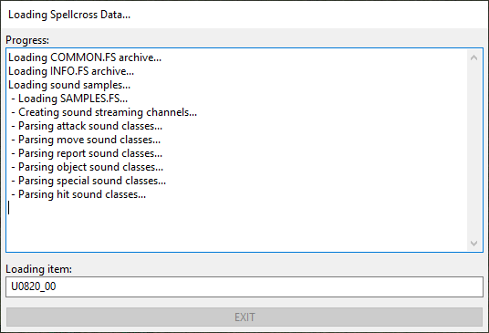

If the loader fails, it should tell you what is missing so you can look up if there are some missing files. That's all for basic setup. There a few things you can setup manually in application `config.ini` file but it should not be necessary to change anything there.

### Viewing maps

Basic purpose of the tool was viewing the maps. So, the first thing to do is to unpack `COMMON.FS` archive in your game installation folder `DATA`. Use my [spellcross_extractfs](https://spellcross.kvalitne.cz/spell_fs_archive/spell_fs_archive.html) tool or extract via editor menu `Tools->Extract FS archive`. The editor can open map `*.DTA` files which contain map graphics, sounds and counter attack start positions for player and enemy. It can also open mission script `*.DEF` file which references one of the `*.DTA` files for map data and it contain units, events, mission objectives and few other things. Note each map can have several `*.DEF` scripts so when you edit something in the map, make sure it's not colliding with any of the `*.DEF` scripts (e.g. some unit placed in the middle of house or something). 

The maps have several layers which can be individually enabled in the editor via menu `View`. There are following layers available:
 - Terrain: Basic terrain layer composed of 13 different shapes of tiles (marked 'A' to 'M'). In the sprite viewer, the third letter of the name is almost always the shape letter but it is also stored in the tile file itself.
 - Objects: Second overlay layer with sprite objects like trees, walls, etc. Note the game engine seems to decide what to redraw based on the terrain tiles. It won't properly render trees without shadows below.
 - Flags: The first two layers share invisible layer of special flags that define properties of the tiles. There are several specific 8-bit codes (see `Tools->Edit tile flags`) and these must be assigned correctly to make Spellcross game engine work properly.
 - Tile animations: Terrain layer overlay animations that replace entire land tile, e.g. bubbling mud.
 - Sprite animations: Generic sprite animations like smoke placed over previous layers.
 - Counter attack positions: Counterattack starting positions for player and enemy. Note these are only used for counter attacks and not for main map playthrough and they are stored in the map `*.DTA` file so it is shared for all map `*.DEF` scripts for given map.
 - Start/Escape/Target positions: These are definitions of player starting tiles, escape tiles (e.g. for convoys) or target tiles which appear in the mini map like a cross symbol (not very common in the game). These are defined in map `*.DEF` files so you can have multiple different variations per map.
When viewing map, you can enable different layers via `View` menu. Note most of the editing of e.g. events is not accessible when the events layer is off.
 - Sound loops: Ambient looping sounds like water, fire, etc.
 - Sounds: Randomly triggered sounds like church bell, etc.
 - Units: Map units (both static and event-spawned).
 - Events: Map events like SeePlace, SeeUnit, etc.
 
Note lot of editing options are not available when related layer(s) are not enabled.

## Editing, objects, tools

The original idea was to implement some sort of recursive auto tile mapping algorithm that would automatically choose matching tiles to the invalidated (edited) tiles based on the surrounding tiles. But this is really tricky to implement. It would be relatively simple task in simple graphical engines like OpenTTD because there are not that many of restricting neighboring tile rules. But Spellcross has about 2000 tiles, 13 land tile shapes and also shaded tile edges to make it look smooth. There are plenty of textures so there are very complex neighboring tile rules. Ordinary bit masking method probably won't do the job here. So, this is not yet implemented. The only auto tile maping that should work now are the walls where the rules are quite simple.

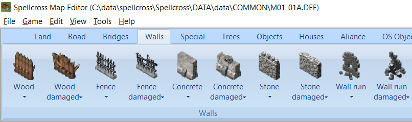

So you can change elevation of the terrain (see menu `Edit` for shortcuts), but the textures won't match. What is also possible is to edit by Copy&Paste tiles or whole blocks of tiles using selection tools. See menu 'Edit' for shortcuts. You can also select individual tiles or animations via viewers in the menu `Tools` and place them. Many of the editing actions are available in right-click pop-up menu in the map area. 

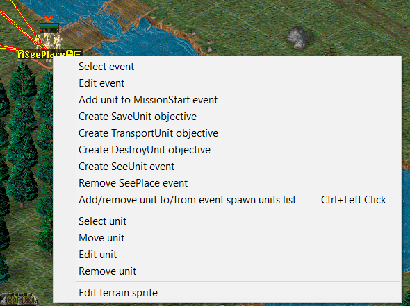

To make it a bit more usable, I made a toolbar ribbon which contain tools with common objects or sprites grouped to simple menus. These were partly generated automatically by processing existing game maps and partly by hand but it does not cover all objects available in the terrain sprite sets especially in the `DEVAST` terrain type because there are just a few maps there. The tools and objects are defined in auxiliary `*.con` files located in the editor subfolder `data`. In several tool panels of the editor you can edit and save its content but I warn anyone that you will loose your changes with new editor releases when I update these files. There is not yet any tool to merge your changes with mine. These files also contain other specific data so the likelyhood of changes are high!

If you want to make a new object that should appear in the tool ribbon, you do it by first selecting the map tiles (see menu `Edit` for shurtcuts). 
You can select which map layers should be included to the selection clipboard via menu `Edit->Select Layer(s)`. 
Then use `Edit->Create New Object`. You can place the object to existing classes or leave it unsorted. Next, you run `Tools->Objects editor` where you can place the object to desired class, create new classes and so. The list supports Drag&Drop style edit. When you close the objects editor, the ribbon with tools should update and make your new object(s) accessible. If you do changes here, you can save it to the `*.con` file via menu `File->Save Objects` otherwise you will loose the changes on editor restart.

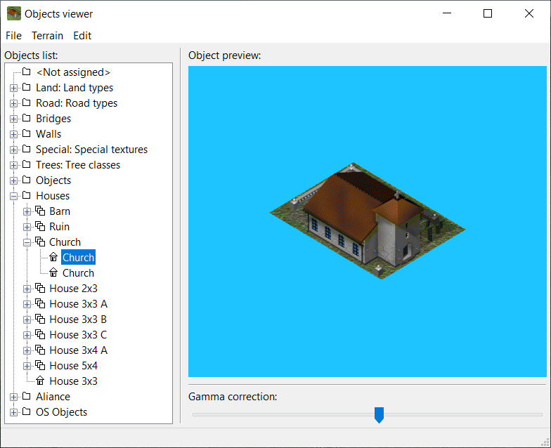  

### Units

What should work fine in current version is placement of units. You can change parameters of units or insert new ones. Note when placing an enemy units, you may choose static units (up to 50) or spawned units by events. Player's units are always just spawned. If you need player units from start, you have to use MissionStart event option. You can convert any unit to spawned and back using right-click pop-up menus. When you select event of specific type (e.g. `SeePlace`), you can attach spawned units by ctrl+right-click on unit. Spawned units are linked with yellow lines.

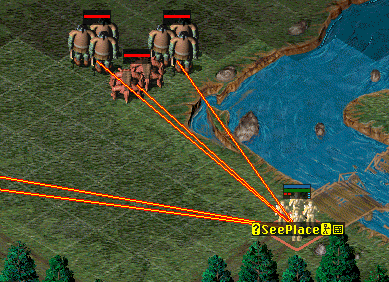
 
In the unit panel you can set basic stuff like XP level, HP and name. There is also a selector for unit AI behaviour and a special unit type for player units. Note only two units of SpecUnit type per mission are allowed. One more thing to do here is setup of unit randomization if the map will be used with my [Spellcross Mod Launcher](https://github.com/smaslan/Spellcross-Mod-Launcher). Randomization rules can be set globally for the mission (see section `Mission parameters`) but it is also possible to define explicit rules for each unit here. You can also disable randomization for the unit.

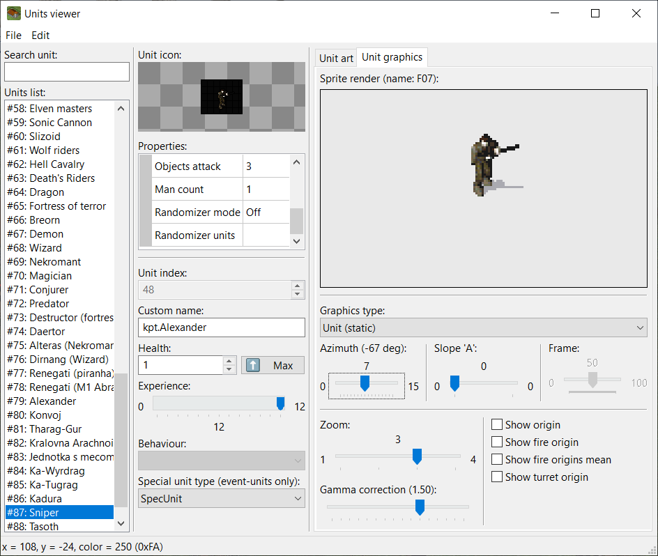

### Events and Objectives

Spellcross supports several types of events and mission objectives. First enable `Events` layer via menu `View`. Most common event is `SeePlace` which is used to spawn unit(s) when the tile is seen first time. This is used for two reasons. First, to overcome units count limit of 50 per map and second, to not allow the unit to move until seen. Another event is `MissionStart` which is mostly used to spawn player units or show initial text message. Any event except the `MissionStart` can be selected by left-click in the map. You can edit it via right-click pop-up menu. For some events you can mark it as Objectives. You can add mission texts or videos from the available resources. Linking spawned units is done in the map (see above).

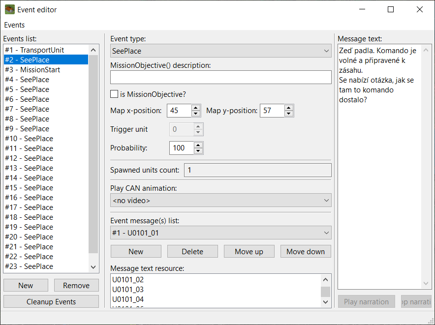
 

### Mission parameters

Via the menu `Edit->Mission parameters` you can launch mission parameters editor. Here you can select mission text resources and eventually enable NightMission() flag. You can also make and manage unit randomization rules if the map will be used with my [Spellcross Mod Launcher](https://github.com/smaslan/Spellcross-Mod-Launcher). You can make one rule for each unit type (check right-click pop-up menus). Don't forget to apply the rules to the units by pressing the buttons below the rules lists. New units are placed with randomization is off by default. 

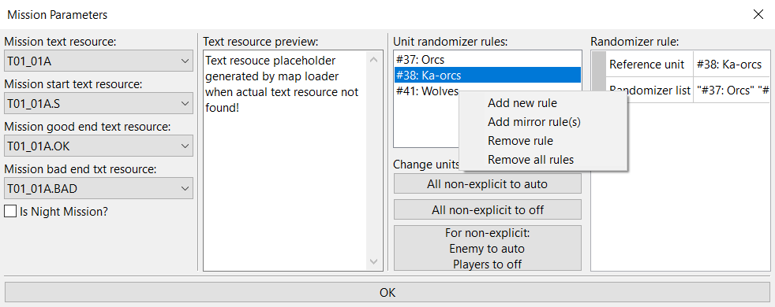

### Sprites viewer

One of basic viewers is sprite graphics viewer accessible via menu `Tools->Sprite Viewer`. You can select sprite and close panel to place sprite to the map. The panel also contain few tools. Most relevant feature is organizing sprites into tool classes. You can select and/or create new tool classes and drag&drop sprites from the left list to those. Changes may be saved to `*.con` file via menu `Edit->Save context data`. The panel also contains export features in the menu `File` which will generate sprite `PNG` images along with metadata necessary to perform encoding back to the Spellcross `*.DTA` (see Graphics Encoder below). 

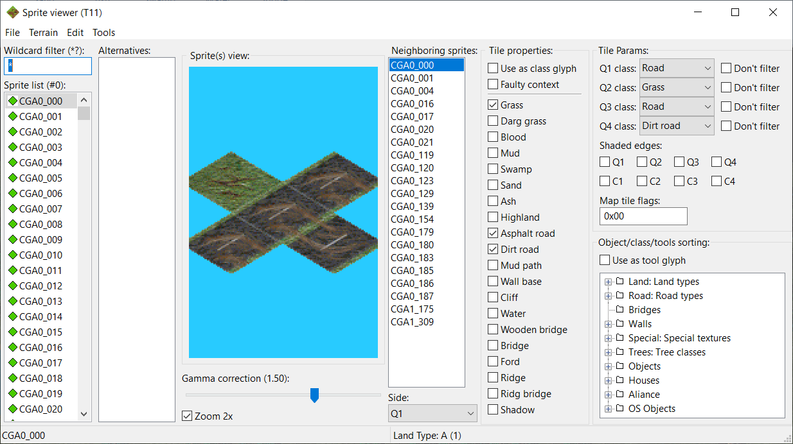

### Animations viewers

Similarly to sprites viewer, you can view and select tile `ANM` or sprite `PNM` animations in menu `Tools->Animations viewer`. For sprite `PNM` animations you also have to define pixel x,y offsets. You can fine tune those by selecting `PNM` in the map and using pop-up menu `Edit PNM tile`. `ANM` are tile animations and those do not have x,y offsets but can be selected and edited in map via pop-up menu as well.  

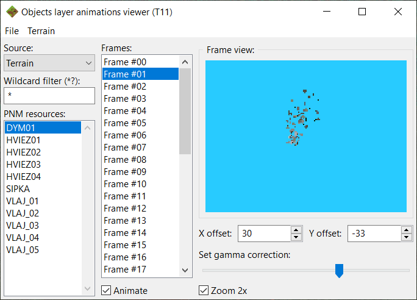

### Sounds viewer

Sound resource panel can be opened via menu `Tools->Sounds viewer`. Spellcross is using two types of sounds in the maps. First are randomly triggered sounds like church bell, bird tweet and so. There seems to be no hard limit on those. The other kind of sounds are ambient loop sounds that plays indefinitely in loop depending on position in the map. These are typically water, forest wind, fire, etc. There is a limit on total samples count of these ambient sounds possibly due to memory limitations. I'm not sure about exact limit, but the game will crash and generate error 'too big length of environment samples' report in its folder. Note this is not about number of sounds but a sum of sample counts of all used ambient sounds. So there are typically just a few per map. This is always trial and error. When you want to place sound use menu `File->Select and close`. You can edit sounds in the map using pop-up menu if the sound layers are visible. 

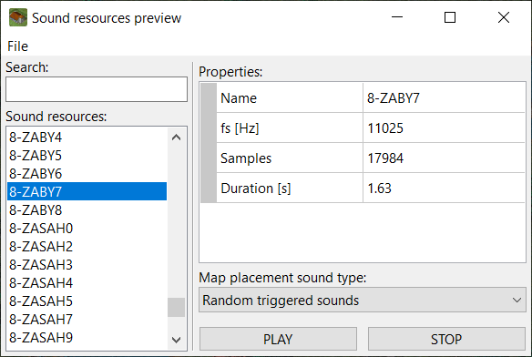

### Palette viewer

You can view and export game palette files via menu `Tools->Palette viewer`. This is mostly useful only if you need to do some graphics editing outside map editor. The output format is text style so I guess you can read it if you need to do something with it. But the `*.palinfo` files are primarily intended to be loaded by editor's graphics encoder (see below).

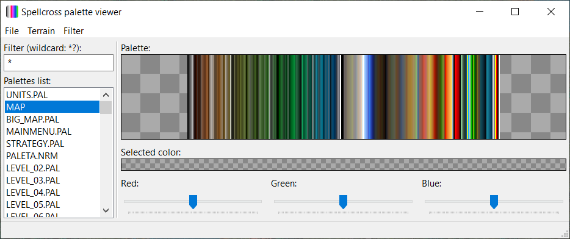 

### Graphics viewer

The editor can also load and display various extra graphics resources outside map tiles. All recognized resources are visible in panel `Tools->Graphics viewer`. Main purpose of this panel is to enable exporting single or range of resources. It will generate PNG images along with metadata necessary to re-encode modified graphics back to Spellcross format using `View->Graphics encoder` tool (see below). The resources include GUI parts, projectiles, buttons, unit info graphics, etc.

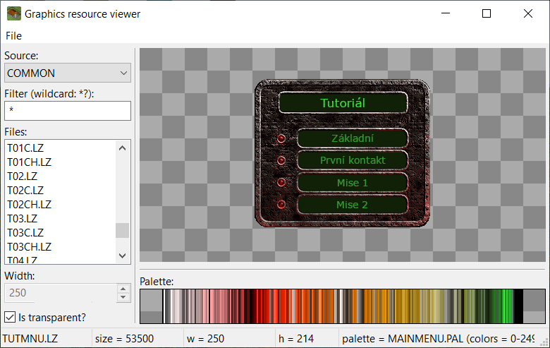

### Text viewer

Another available tool is `Tools->Text view/editor`. This panel allows to browse loaded text resources. The main reason for this tool is Spellcross does not have automatic word wrapping, so it has to be done here in preprocessing if you want to do any changes in the texts. Also, Czech version of the game is using weird encoding CP895 which is mostly not available in any common text editor so the tool is solving this issue. You can edit the texts or add new ones but the changes are only in the loaded editor data. When you want to save the changes, you have to use `File->Export`. This is intended to be used with [Spellcross Mod Launcher](https://github.com/smaslan/Spellcross-Mod-Launcher) so you save the created/modified texts to the mod folders, then rebuild the mod and eventually reload the data to the editor again (see above).  

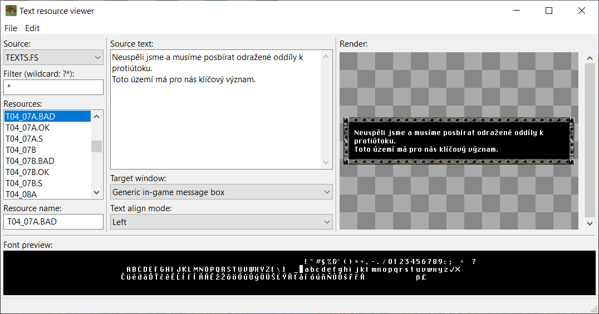

### Raw text editor

Another text related tool is `Tools->Raw text view/editor`. Intention of this tool was mainly for editing Czech localization texts which are using uncommon CP895 encoding. So it can be used to do basic editing in correct encoding.

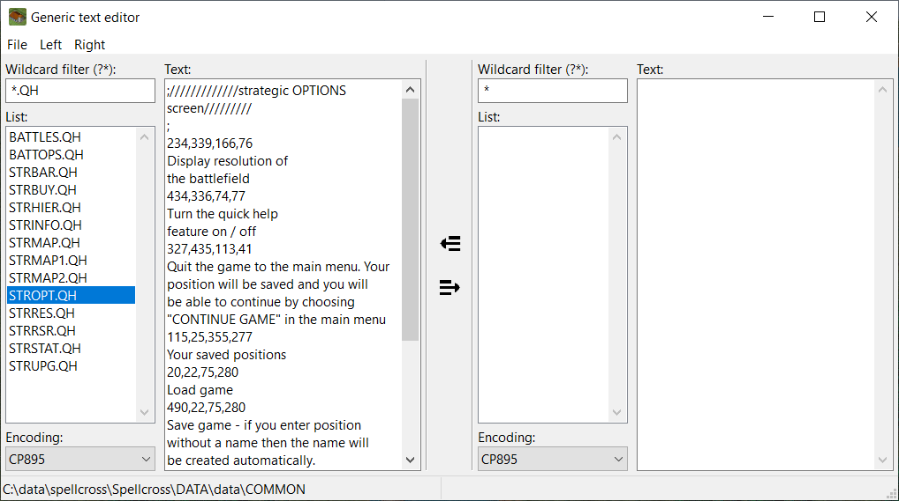

### Trees randomizer

The trees are a bit bland in the game so I needed a way to replace them in the maps. So I made a simple randomizer tool to do that. In the menu `Edit->Trees randomzier config` you can create randomization rule sets from->to with probabilities. The randomizer is using tree groups/names store in `*.info` files in application subfolder `data/tree_randomizer/`. These files are exports from Objects editor (see above). The files are not necessary but makes its use easier.    
Once you setup the randomizer, you can apply it via menus `Edit->Randomize...` either to entire map or to cursor or persistent selection ranges.

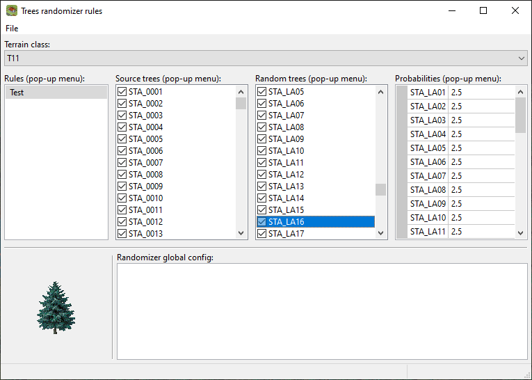

### Graphics encoder

When I started experimenting with mods, I needed to change some of the graphics as well. In past I did that by standalone tools, but it was not very practical so I integrated graphic resources encoder directly to the editor. You can run the encoder via menu `Tools->Graphics encoder`. Simplest way to use it is to export some graphics e.g. from `Graphics viewer` or `Sprite viewer` and just modify the generated PNG files, then use this tool to re-encode back to the Spellcross format(s). The encoder always need three files: PNG file with the graphics itself, metadata `*.info` file with parameters of the graphic resource (format, size, colors, ...) and finally color palette file `*palinfo` with target color palette to which the resource should be encoded. This file can be obtained from palette viewer or from exported graphic resource. When you open graphical resource in this tool it should also list all other resources in the folder that share the same color palette. This is needed in case you decide to regenerate palette as it is often shared for multiple resources. Hence, you have to re-encode all resources, not just the one modified. However, I would not recommend to regenerate color palettes because they are often composed of several chunks that are shared in different parts of the game engine, so likelyhood you messup something is rather high unless you know exactly how it works. Regeneration of palettes make sense almost exclusively for unit info renders where each image has its own palette. Alternatively you can open batch of resources (images) in which case each loaded resource will have different palette. This is useful for generating e.g. INFO.FS unit renders. When you open images and the `*.info` resources are not found, the tool will offer automatic generation of defaults ones.

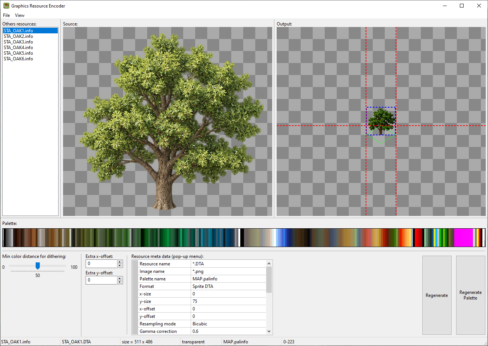

The encoder can now encode following data:
 - Sprites (terrain and object) to `*.DTA` files.
 - General graphics compressed to `*.LZ` files like game GUI panels or unit info renders.
 - Projectile `*.GFK` sprites.
 - Sprite animation `*.PNM` files.
 - Unit sprite graphics compatible with `UNITS.FSU` archive.
 
Metadata `*.info` file recognizes following items:
 - `name`: Source/result Spellcross file name such as 'STA_0001.DTA'. The name can be also '*.DTA' so the file will be named as this info file.
 - `image`: Name of PNG image file, for PNM animations, this is just a placeholder. The value can be also '*.png', so the encoder expects name being identical to this info file.
 - `images`: Matrix of PNG file names for individual frames of the PNM animation. This overrides `image` for PNM format.
 - `format`: Spellcross format of the resource:
   - 'DTA' - terrain and object layer sprite files.
   - 'LZ' - generic LZ compressed bitmaps.
   - 'GFK' - uncompressed projectile sprites.
   - 'PNM' - PNM sprite animations.
   - 'UNITS.FSU' - Unit sprite graphic files (content of `UNITS.FSU` archive)
 - `xsize`, `ysize`: x,y sizez of the image, can be 0 for auto size from PNG size. If the size is different from PNG image size, the tool will resample to desired size. If one of the sizes is zero, it will resize keeping aspect ratio.
 - `xoffset`, `yoffset`: x,y offsets to be stored to the resulting Spellcross file if supported. This is used e.g. for object sprites `*.DTA`.
 - `resampling`: Mode of image resampling if used:
   - 'Nearest': no interpolation.
   - 'Bilinear': bilinear interpolation.
   - 'Bicubic': bicubic interpolation.
 - `gamma`: gamma correction for source image preprocessing.
 - `chroma`: chroma correction for source image preprocessing.
 - `hue`: hue shift correction for source image preprocessing.
 - `landtype`: terrain tile shape index 0 to 13 for 'DTA' format. Objects such as trees should be 0, terrain sprites must be 1 to 13.
 - `center_to_width`: Auto center image to given width. This is useful e.g. for 'DTA' object sprites which are mostly aligned to center of 80 pixels box. Use 0 to disable.
 - `tree_auto_y_offset`: Non-zero value to enable auto calculation of `yoffset` value for typical tree sprites. The `yoffset` is then extra offset added to the auto calculated value.
 - `transparent`: Non-zero marks image as transparent.
 - `alpha_threshold`: 8-bit alpha channel threshold value to quantize alpha-blended images. Default is half-range 128.
 - `shadow_color`: 8-bit 'R,G,B' color designating shadow for 'UNITS.FSU' format. This color will be encoded as a Spellcross shadow index 0xFD.
 - `palette`: name of color palette file `*.palinfo` to be used to encode the image.
 - `colors`: string defining range of color palette indices to be used for encoding. E.g. '0-127,250-253' will limit encoding to color indices 0-127 and 250-253.
 - `regen_palette`: regenerate palette on resource save.
 - `regen_palette_preset`: preset name for the palette regeneration on resource save. So far only 'INFO.FS' is available.
 - `export_palette`: non-zero to export palettes on resource save.

## Game mode

At certain point of development I got idea that I could integrate crude version of game engine to the editor. I did not get too far though. I was able to implement basic features like view and attack ranging, path finding, basic state machine for unit movement and actions and events. But I broke some of those things on the way as I was more focused on the editor. You can activate the game mode via menu `Game` but it won't do too much now. But there is a fork of this project that focuses on the game engine part. See [Spellcross Reloaded](https://github.com/luboshorak/spellcross_restoration_tools). The project seems to be on hold, but it definitely moved forward compared to my editor.

## Credits

The project uses few very useful external open source libraries:
- [Spellcross Mod Launcher](https://github.com/smaslan/Spellcross-Mod-Launcher): shared Spellcross handling libraries 
- [wxWidgets](https://github.com/wxWidgets/wxWidgets): multiplatform graphical used interface 
- [simpleini](https://github.com/brofield/simpleini): cross-platform library handling INI-style conf. files 
- [RtAudio](https://github.com/thestk/rtaudio): multiplatform audio API 
- [cxxmidi](https://github.com/5tan/cxxmidi): multiplatform midi library 

## Building the project

If you like to make your own builds you certainly can. The project was made in pure C++20 in Microsoft Visual Studio 2019, so there should be no problem building it. The whole thing was made 100% using standard C++ libraries and a few multiplatform open source libraries listed above. The only hurdle is to properly link it with `wxWidgets` libraries. You have to download those and build them first, then set some system path variables and also change paths in the MSVC project file. That is always a bit of a mess when I start on a new PC. 

## Releases

Here are available release builds for 64-bit Windows. It was tested in Windows 10, but should work in Windows 11 as well. There is no installation, just download ZIP file, unpack it where you like it and run it. There may a bit issue with Windows 11 security settings though. So far I do not have certificate so I cannot build a signed trusted installer. This may result in problems with Windows "Smart App Control" or "App Install Control" or whatever it is called depending on your system setup. But I'm working on it!
Also, you can star my project here on GitHub if you like to help me out on a way to get the certificate.   

- [V0.90 beta, 27th Septmeber 2026 (7zip file)](./builds/x64/Spellcross-Map-Editor-V0.90-beta.7z) 
  - First release (careful, not fully tested).
  - Not finished. 
  - Very very buggy.

                                 
## License
The tool is distributed under [MIT license](./LICENSE.txt). 
  
  
